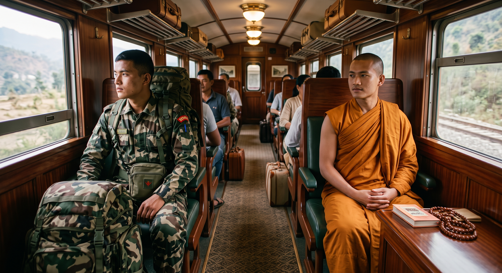
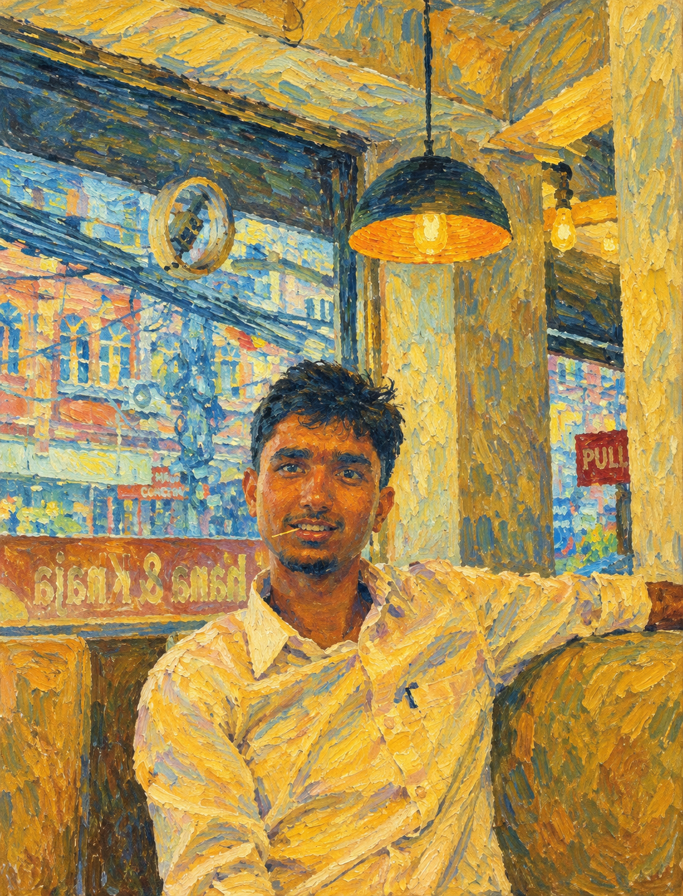
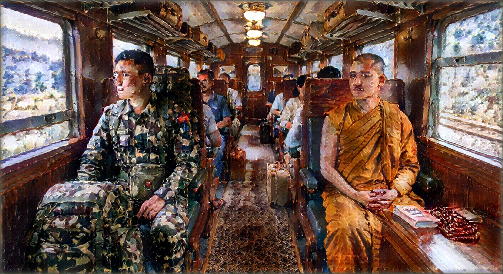

<div align="center">

# 🎨 Stylo
### *Real-Time Arbitrary Neural Style Transfer Studio*

[](https://python.org)
[](https://pytorch.org)
[](https://fastapi.tiangolo.com)
[](https://react.dev)
[](https://vitejs.dev)
[](https://tailwindcss.com)
[](LICENSE)
[](CONTRIBUTING.md)

<p align="center">
  <b>Transform any photograph into an artistic masterpiece in milliseconds.</b><br>
  Powered by Adaptive Instance Normalization (AdaIN), CORAL Color Preservation, and Multi-Style Feature Interpolation.
</p>
<h3 align="center">This is Just prototype so result may not be perfect but try to improve it by changing settings or Contributing to this Project</h3>
<h2>Frotend  Code is written By AI.

[Key Features](#key-features) •
[Architecture](#how-it-works) •
[Quickstart](#quickstart) •
[Interactive Web Studio](#interactive-web-studio) •
[Citation](#citation)

---
| Original | Style(Van Gogh )  | After |
|--------|-------|-------|
|  |  |  |

</div>

## Key Features

- **Arbitrary Style Transfer**: No per-style training required. Feed any style image and any content image at test time for immediate stylization.
- **Continuous Stylization Control ($\alpha$)**: Linearly interpolate between the raw photographic content ($\alpha=0.0$) and full artistic painterly texture ($\alpha=1.0$).
- **CORAL Color Preservation**: Integrates Correlation Alignment (CORAL) to recolor style feature representations to match the content image's color distribution, transferring brushstroke texture while preserving natural photograph colors.
- **Multi-Style Weighted Blending**: Blend $N$ arbitrary artistic styles onto a single content image in latent feature space with real-time normalized weight rebalancing ($\sum w_i = 1.0$).
- **Dual-Engine Acceleration**: Full GPU (CUDA) acceleration with automatic fallback to optimized CPU inference.
- **Production-Ready Full Stack**: High-throughput asynchronous **FastAPI** backend coupled with a modern, glassmorphic **React 18 + Vite** UI studio.
- **Headless & Programmatic**: Complete REST API for programmatic batch processing via Python SDK or `curl`.

---

## How It Works

Stylo implements **Adaptive Instance Normalization (AdaIN)** ([Huang & Belongie, ICCV 2017](https://arxiv.org/abs/1703.06868)). Instead of optimizing pixels iteratively via slow optimization loops (e.g. Gatys et al.), AdaIN performs style transfer in a single feed-forward pass by aligning feature statistics.

```
Content Image (c) ---> [ Fixed VGG-19 Encoder ] ---> f(c) ---+
                                                             +---> [ AdaIN Layer ] ---> t ---> [ Learned Decoder ] ---> Stylized Output
Style Image (s)   ---> [ Fixed VGG-19 Encoder ] ---> f(s) ---+          ^
                                                                        |
                                                        (Optional CORAL Color Match)
```


---

## Repository Structure

```tree
DIP/
├── backend/                        # FastAPI Neural Inference Engine
│   ├── app/
│   │   ├── api/routes.py           # REST endpoints (/stylize, /interpolate, /presets)
│   │   ├── core/config.py          # Device detection, paths, CORS configuration
│   │   ├── models/adain_net.py     # VGG-19 truncated encoder & Decoder architectures
│   │   ├── services/
│   │   │   ├── adain_service.py    # AdaIN, CORAL alignment & tensor transforms
│   │   │   └── model_manager.py    # Singleton checkpoint loader & weight caching
│   │   └── main.py                 # Lifespan startup handler & CORS middleware
│   ├── presets/                    # Built-in sample styles and photos
│   ├── requirements.txt            # Backend dependencies
│   ├── run.py                      # Development launcher
│   └── venv/                       # Pre-configured Python virtualenv
│
├── frontend/                       # Modern React 18 Studio
│   ├── src/
│   │   ├── components/
│   │   │   ├── Controls.jsx        # Alpha slider, resolution picker, CORAL switch
│   │   │   ├── ImageDropzone.jsx   # Drag-and-drop file uploaders with preview
│   │   │   ├── InterpolationControls.jsx # Multi-style blend & weight rebalancer
│   │   │   ├── ResultView.jsx      # Side-by-side comparison & high-res download
│   │   │   └── StylePresetSelector.jsx # 1-click preset styles gallery
│   │   ├── api.js                  # Frontend REST API client
│   │   └── App.jsx                 # Studio layout and workflow coordinator
│   ├── package.json
│   └── vite.config.js              # Vite bundler with reverse proxy
│
├── model/                          # Pre-trained Checkpoints
│   ├── decoder.pth                 # Trained feature decoder (512 -> 3)
│   └── vgg_normalized.pth          # Truncated VGG-19 encoder up to relu4_1
└── notebooks/
    └── adaptivein.ipynb            # Original research & training notebook
```

---

## Quickstart

### Prerequisites
- Python 3.10+
- Node.js 18+ and `npm`

### 1. Backend Setup

```bash
# Navigate to backend directory
cd DIP/backend

# Activate the virtual environment
source venv/bin/activate

# (Optional) If setting up a new environment:
# pip install torch torchvision --index-url https://download.pytorch.org/whl/cpu
# pip install -r requirements.txt

# Start the inference server
python run.py
```
> Server will boot at **`http://localhost:8000`**  
> Interactive OpenAPI Docs: **`http://localhost:8000/docs`**

### 2. Frontend Studio Setup

```bash
# Open a new terminal tab and navigate to frontend
cd DIP/frontend

# Install dependencies (first time only)
npm install

# Start the Vite development server
npm run dev
```
> Web studio will launch at: **`http://localhost:5173`**

---

## Interactive Web Studio

| Mode | Capability |
|---|---|
| **Single Style Transfer** | Upload a photo + artwork, slide $\alpha$ from 0% to 100%, and toggle CORAL color preservation. |
| **Multi-Style Blend** | Combine up to 4 styles simultaneously with interactive, auto-rebalancing weight sliders and direct numeric input. |
| **Style Presets** | Instant 1-click styles ready out of the box. |
| **Side-by-Side Comparison** | Compare original content vs stylized output side-by-side. |
| **High-Res Export** | One-click instant JPG export. |

---

## Model Weights & Checkpoints

The model weights are located in `DIP/model/`:
- `vgg_normalized.pth` (~77 MB) — Truncated VGG-19 encoder.
- `decoder.pth` (~14 MB) — Symmetrical inverted convolutional decoder.

> **Automatic Fallback:** If checkpoint files are missing locally, `model_manager.py` automatically downloads verified weights from Hugging Face Hub (`tidalove/adain`).

---

## Citation

If you use this implementation in your research or project, please cite the foundational AdaIN paper:

```bibtex
@inproceedings{huang2017adain,
  title     = {Arbitrary Style Transfer in Real-time with Adaptive Instance Normalization},
  author    = {Huang, Xun and Belongie, Serge},
  booktitle = {ICCV},
  year      = {2017}
}
```

---

## License

This project is licensed under the **MIT License** — feel free to use, modify, and distribute for academic and commercial applications.